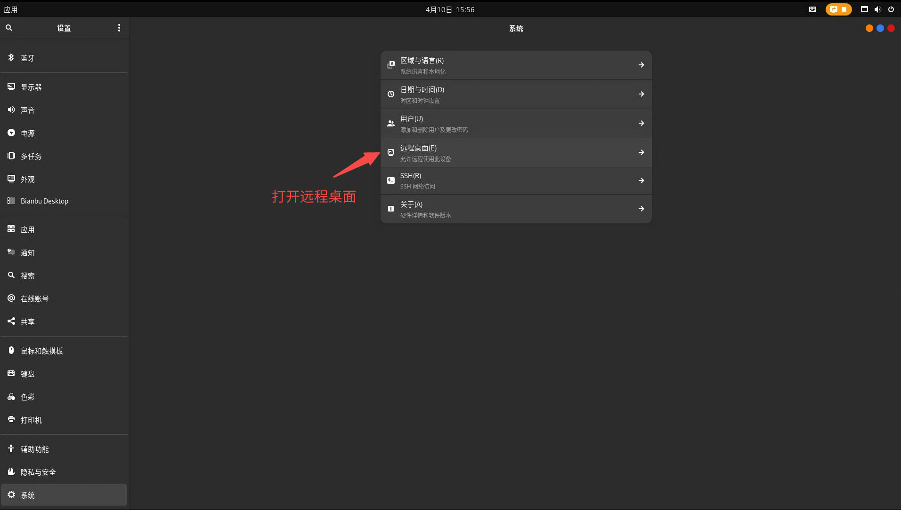

# SSH

Bianbu Robot默认开启SSH服务端，可直接通过`ssh hostname@remote_ip`命令连接到开发板。

# RDP

## 服务端（开发板）

Bianbu Robot配置了RDP协议实现PC对开发板的远程访问。

（1）打开系统设置


（2）导航到“系统->远程桌面”



（3）打开“桌面共享”和“远程控制”选项


记住端口号，同时可以设置登录的用户名和密码。

## 客户端

PC（支持Windows和Linux）可通过远程连接客户端访问开发板桌面。

### Windows客户端

Windows可使用“远程桌面连接”软件来访问开发板，连接时要计算机名称填写`remote_ip:port`，如图所示。


### Ubuntu客户端

Ubuntu可使用Remmina软件来访问开发板桌面。

（1）下载Remmina

```python
sudo sudo apt update
sudo sudo apt install remmina remmina-plugin-rdp remmina-plugin-vnc remmina-plugin-secret
```

（2）启动Remmina

```python
remmina
```

输入上述命令之后，会弹出登录界面，选择RDP协议并输入开发板的IP和RDP端口号进行连接，如图所示：

