# RV4B用户使用指南

## **产品简介**  

RV4B是进迭时空生态产品开发板系列，第一代搭载了进迭时空八核RISC-V高性能处理器K1，核内融合2.0Tops通用AI算力，可支持所有AI模型算法的快速部署。

RV4B充分展现了K1的方案和接口扩展性，设计引出了K1芯片原生的MicroHDMI、网口、USB3.0等接口，可适配进迭自研BianbuOS、BianbuNAS、OpenHarmony、OpenKylin、Deepin等操作系统。

## **前言**

### **概述**

本文档主要介绍RV4B基本功能和硬件特性，旨在帮助调试人员更快、更准确地使用RV4B，熟悉K1芯片开发应用方案。

**产品版本**

本产品对应的产品版本如下：

| **产品名称** | **产品版本**                          |
| :----------- | :------------------------------------ |
| RV4B         | RV4B_P1_LP4X200B32X1_D6T_V10_04231610 |

**适用对象**

本文档主要适用于以下工程师：

技术支持工程师、单板硬件开发工程师、嵌入式软件开发工程师、测试工程师

## **修订记录**

修订记录累积了每次文档更新的说明

| **修订版本** | **修订日期** | **修订说明** |
| ------------ | :----------- | :----------- |
| V1.0         | 2025-03-25   | /            |

## **缩略词**

缩略语包括文档中常用词组的简称

| **缩略词** | **英文描述**                    | **中文描述**     |
| ---------- | ------------------------------- | ---------------- |
| X60        | Self-Developed X60™ RISC-V Core | 进迭自研RISC-V核 |

## **产品规格**

| **处理器**   | SpacemiT K1，8核64位RISC-V处理器, 融合2.0 TOPS AI算力        |
| :----------- | :----------------------------------------------------------- |
| **显示**     | Micro HDMI Type-A接口，最高支持1080P@60Hz、2lane MIPI DSI FPC接口，最高支持1080P@60Hz |
| **内存**     | LPDDR4X，2400MT/s速率，可选配4GB/8GB/16GB容量                |
| **本地存储** | eMMC 5.1，配置32GB                                           |
| **扩展存储** | TF卡接口，支持UHS-Ⅱ模式存储卡                                |
| **无线通讯** | 支持Wi-Fi6＆BT5.2                                            |
| **有线网络** | 支持1路以太网，RJ45接口，1000M/100M自适应                    |
| **音频接口** | -                                                            |
| **USB接口**  | 4路USB3.0                                                    |
| **调试接口** | 40Pin标准GPIO接口，附带测试点，用于硬件复位、开关机和烧录升级 |
| **MIPI接口** | 1路 2lane MIPI DSl、1路 2lane MIPI CSl                       |
| **操作系统** | 预装Bianbu OS，支持 Ubuntu、OpenHarmony等操作系统            |
| **电源输入** | 支持USB供电                                                  |
| **可靠性**   | 外设接口ESD可防护接触±4kV，空气±8kV                          |

## **系统概述**

### 1. **K1芯片概述**

K1是一款高性能、超低功耗的SOC，集成了8核RISC-V CPU内核和SpacemiT®道一™AI计算能力。K1具有以下特点：

• 集成SpacemiT®自主创新X60™RISC-V处理器核，遵循RISC-V 64GCVB体系结构和RVA22标准。

• 通过探索RISC-V定制指令扩展2.OTOPS AI算力，实现CPU AI融合算力，支持TensorFlowLite、TensorFlow、ONNX RunTime等主流AI推理框架

• 通过实现不同电源的划分，以及不同层级的功率状态。实现超低功耗，使K1更具竞争力和领先优势。

• 支持全功能界面，丰富更具创新性的应用程序和产品。

• 兼容主流操作系统，满足各种应用场景的需求。

• 符合工业级可靠性标准。

### 2. **K1芯片框图**

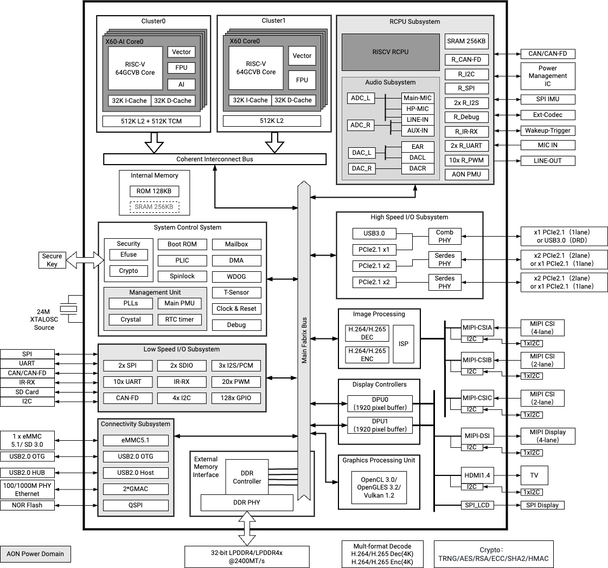 

### 3. **K1** **RV4B**参考方案框图

#### **3.1 参考方案框图**

K1 RV4B 系统采用K1 的芯片，P1 PMIC+外挂DCDC的供电方案；DRAM采用LPDDR4X、eMMC5.1；包括USB3.0 TYPEA、WIFI/BT、TF Card、micro HDMI TX、MIPI DSI、MIPI CSI、TYPEC、RJ45 等外设接口，集成了一个稳定的可量产化的方案。参考方案框图如下：

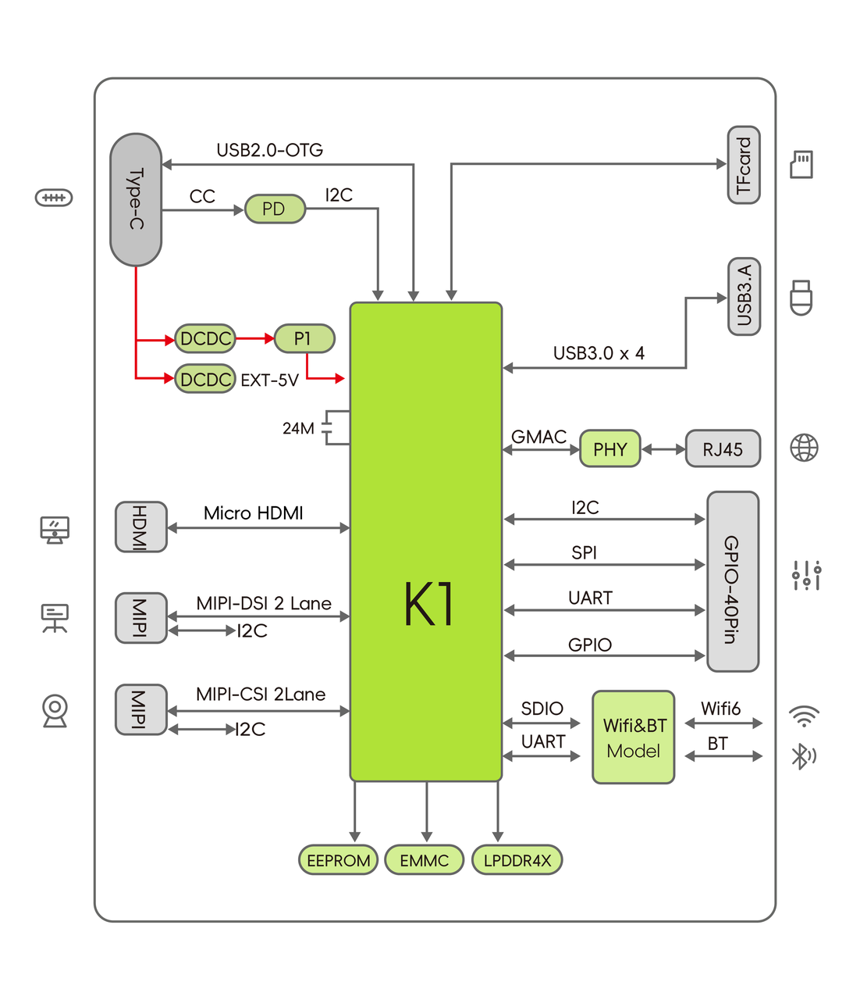

#### **3.2 功能概述**

K1 RV4B包含的功能如下：

￮ TYPEC：一路USB2.0 DEVICE TYPEC 接口，兼容系统固件升级通道及5V/3A供电通道

￮ HDMI1.4 OUT：一路 HDMI1.4 OUT micro接口，最大可支持 1920x1080@60Hz 输出

￮ MIPI DSI/TP：通过15pin座子，一路2lane MIPI DSI信号支持LCD屏、一路I2C信号支持CTP屏。可通过配套屏转接小板实现显示、触摸功能。

￮ MIPI CSI：通过15 pin高速座子，1路 2lane MIPI CSI 信号分别支持16M与8M摄像头；可通过座子对应线序设计小板匹配特定摄像头模组。实现拍摄录像功能。

￮ 40pin双排插针：兼容树莓派4b标准40pin双排插针，支持I2C、UART、SPI、JTAG和GPIO调试

￮ TF卡座：支持高速TF卡

￮ SDIO WIFI：WIFI型号为RTL8852BS，外置SMA天线，支持无线上网功能

￮ Ethernet：支持一路RJ45接口10/100/1000M以太网

￮ USB3.0 TYPEA：四通道USB3.0 TYPEA接口，用于扩展USB设备

￮ UART Debug：用户调试查看 LOG 信息使用；支持3 pin单排插针（J25）调试X60；支持26pin双排插针pin6、8、10调试RCPU

￮ JTAG：支持26pin双排插针pin7、11、13、15调试PRI JTAG。支持通过配套的TF卡转接子板调试SEC2 JTAG

￮ System Key：包含 Reset、PWRON、DownLoad（FEL）测试点

￮ SWITCH：支持启动介质选择

#### **3.3 功能接口**

| **功能**                | **是否可用** |
| :---------------------- | :----------- |
| LPDDR4x (4GB)           | YES          |
| eMMC (16GB)             | YES          |
| HDMI1.4 OUT             | YES          |
| MIPI DSI/TP             | YES          |
| MIPI CSI                | YES          |
| TF卡                    | YES          |
| SDIO WIFI&BT            | YES          |
| 千兆网口10M/100M/1000M  | YES          |
| USB3.0 TYPEA X4         | YES          |
| UART Debug (3pin+26pin) | YES          |
| JTAG (40pin)            | YES          |
| System Key              | YES          |

## **硬件介绍**

### 1. **实物图**

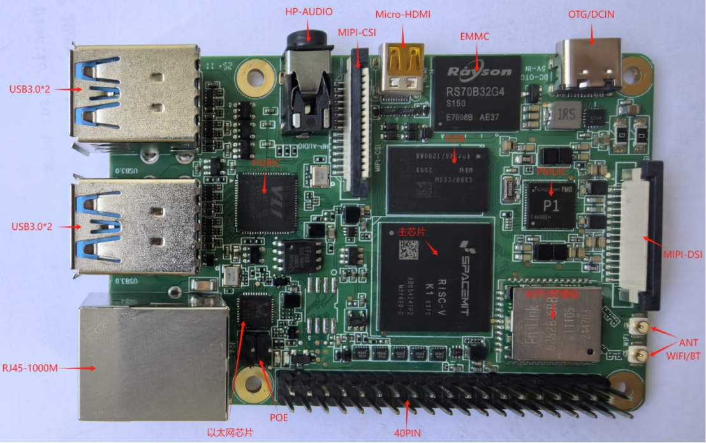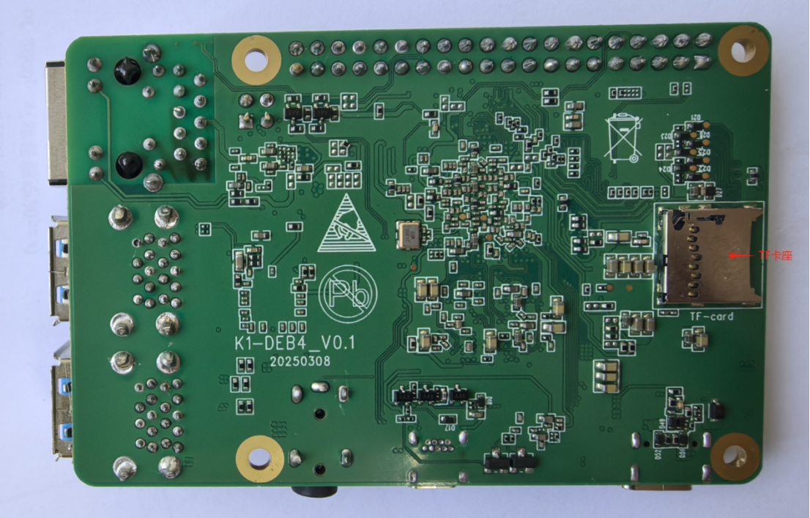 

### **2. 电源框图**

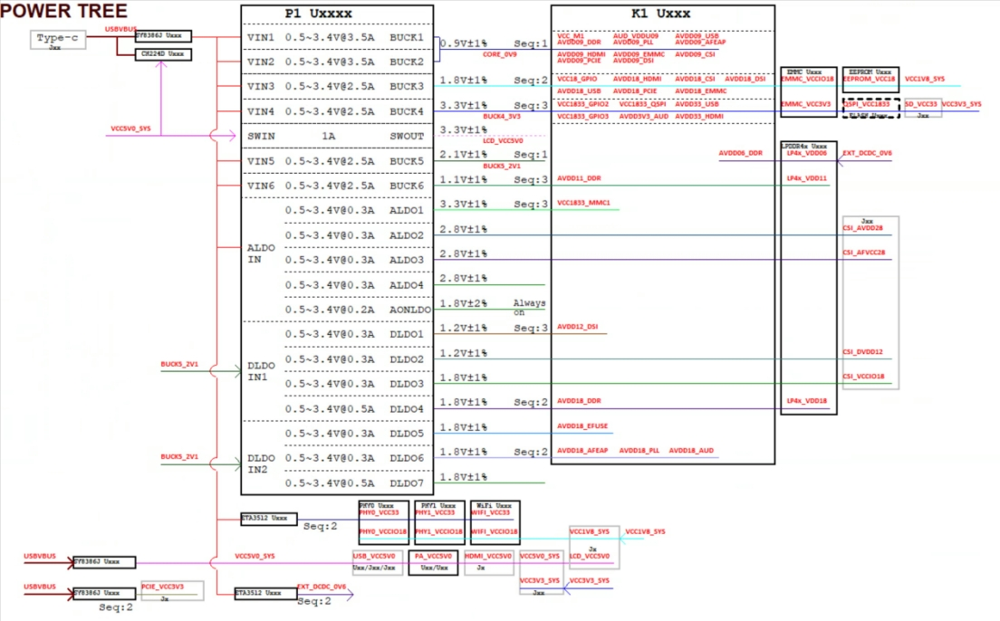 

### **3. Boot Download Sel&JTAG Sel**

SEC2 JTAG配置电路：K1 SEC2 JTAG与MMC1（TF CARD）接口复用，当JTAG_SEL拉高，MMC1_CMD拉低，即可配置为SEC2 JTAG调试X60 CPU

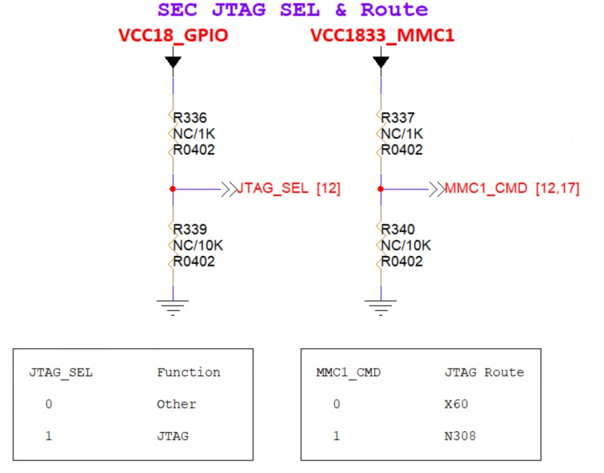 

| TF卡信号名称 | 复用JTAG信号 |
| :----------- | :----------- |
| MMC1_CLK     | SEC2_TCK     |
| MMC1_DATA0   | SEC2_TRSTn   |
| MMC1_DATA1   | SEC2_TDO     |
| MMC1_DATA2   | SEC2_TDI     |
| MMC1_DATA3   | SEC2_TMS     |

需要注意的是，当设备插入了写入固件的TF Card，无论拨码开关在何种配置下，设备都会从TF Card启动。

### **4. I2C地址**

开发板预留丰富的外围接口，用户调试I2C外设会涉及到I2C通道复用情况，下图为现有的开发板器件对应的I2C地址和上拉电源，避免地址冲突和电平不匹配。

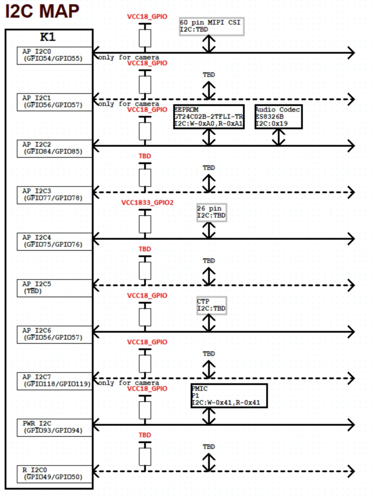 

## **模块简述**

### **1. 电源输入**

RV4B仅提供一种电源输入方式：Type-C输入，需使用支持5V-3A的适配器。通过前端降压变换器（buck）电源后，得到电源VCC5V0_SYS与VCC4V0，分别给外挂DCDC和PMIC供电，输出不同电压供系统使用。同时支持OTG烧录功能。

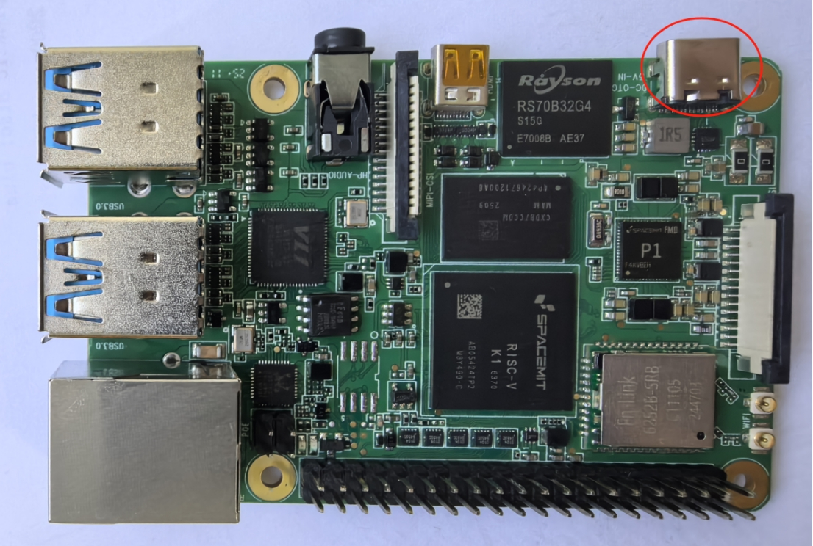 

### **2. 存储器**

eMMC：开发板上存储类型为eMMC FLASH，默认使用的容量32GB

SPI Flash：开发板预留 SPI 器件位置

DDR：开发板 DDR 使用一片LPDDR4X

EEPROM：开发板支持EEPROM存储板卡信息

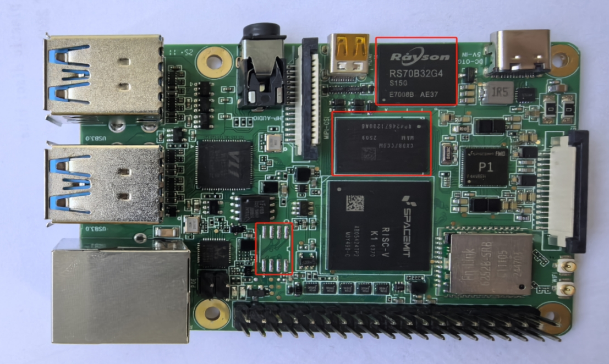 

### **3. 按键输入**

RV4B支持电源开关按键、烧录按键和复位按键

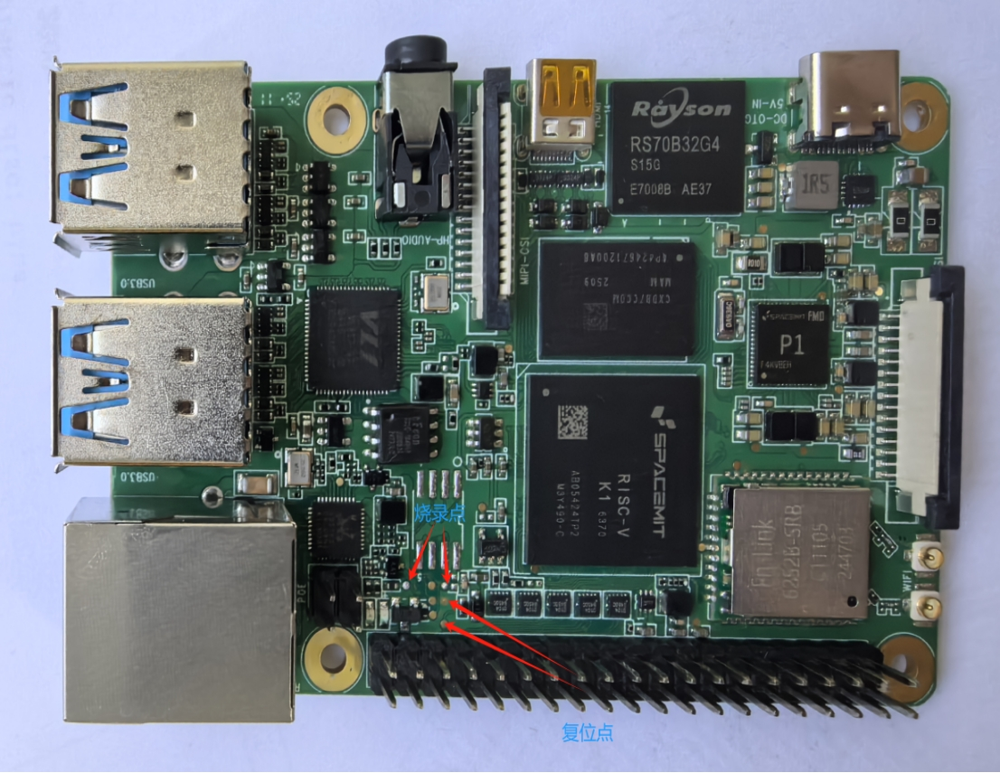 

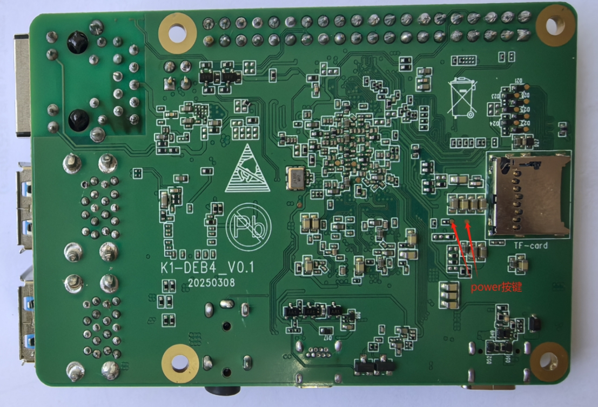 

### **4. MIPI CSI 高速连接器**

RV4B支持某一摄像头模组，高速连接器包含一组2lane信号，可根据高速连接器对应线序自行设计小板来匹配特定模组组合。

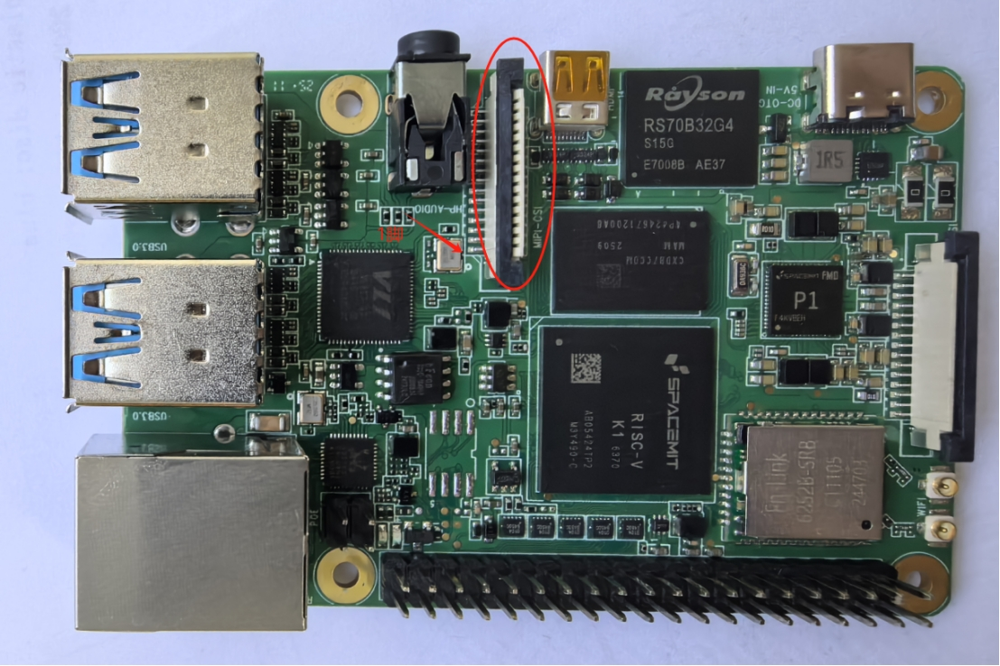 

15pin-高速连接器接口线序如下：

| pin  | 信号名称       | 信号名称       | pin  |
| :--- | :------------- | :------------- | :--- |
| 1    | GND            | MIPI_CSI3_D2N  | 2    |
| 3    | MIPI_CSI3_D2P  | GND            | 4    |
| 5    | MIPI_CSI3_D3N  | MIPI_CSI3_D3P  | 6    |
| 7    | GND            | MIPI_CSI2_CLKN | 8    |
| 9    | MIPI_CSI2_CLKP | GND            | 10   |
| 11   | CAM_GPIO111    | NC             | 12   |
| 13   | CAM_I2C1_SCL   | CAM_I2C1_SDA   | 14   |
| 15   | VCC3V3_SYS     |                |      |

### **5. MIPI DSI屏连接座**

RV4B支持1080P屏，屏座接口型号为FPC-1.0K-NPB 

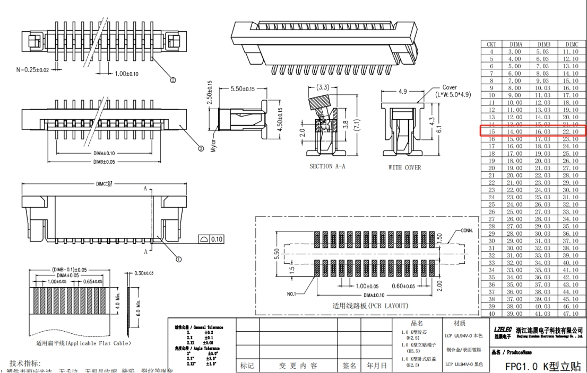 

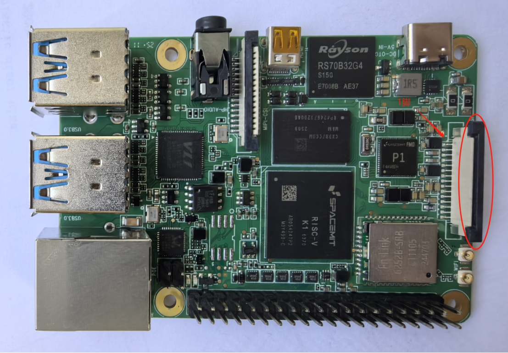 

屏接口顺序

| pin  | 信号名称           | 信号名称           | pin  |
| :--- | :----------------- | :----------------- | :--- |
| 1    | GND                | MIPI_DSI1_LANE1_DN | 2    |
| 3    | MIPI_DSI1_LANE1_DP | GND                | 4    |
| 5    | MIPI_DSI1_CLK_N    | MIPI_DSI1_CLK_P    | 6    |
| 7    | GND                | MIPI_DSI1_LANE0_DN | 8    |
| 9    | MIPI_DSI1_LANE0_DP | GND                | 10   |
| 11   | DSI_I2C0_SCL       | DSI_I2C0_SDA       | 12   |
| 13   | GND                | VCC3V3_SYS         | 14   |
| 15   | VCC3V3_SYS         |                    |      |

### **6. HDMI输出接口**

开发板支持一路 HDMI 标准 micro 输出接口，最大支持 HDMI1.4，最大可支持 1080p 60fps 视频输出

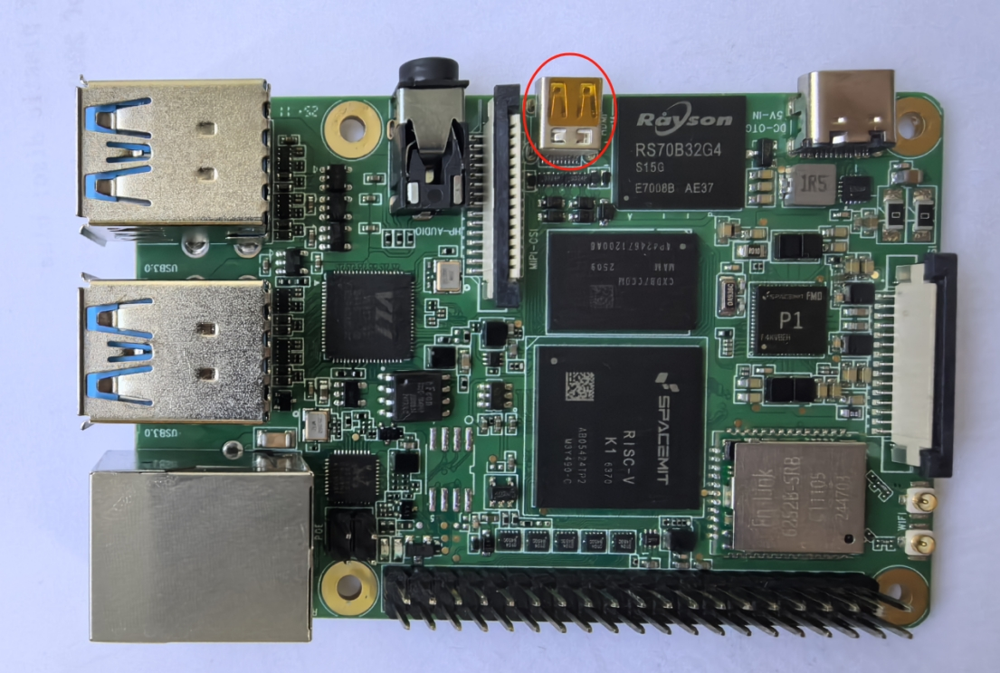 

### **7. USB接口**

RV4B提供四个USB3.0接口，方便开发者接入USB设备。

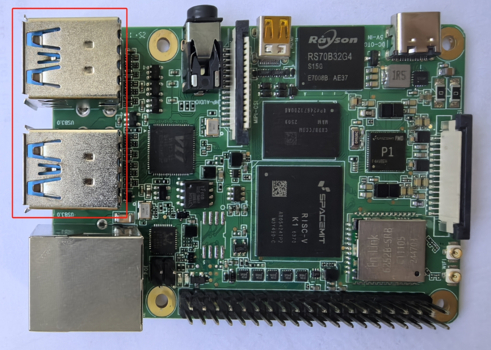 

### **8. RJ45接口**

RV4B支持1个RJ45千兆网接口

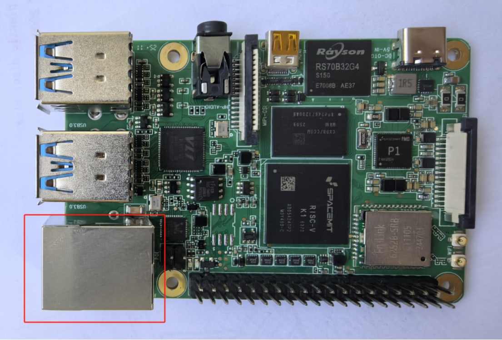 

### **9. wifi/BT模组**

RV4B支持wifi/BT模组，支持无线上网和蓝牙功能

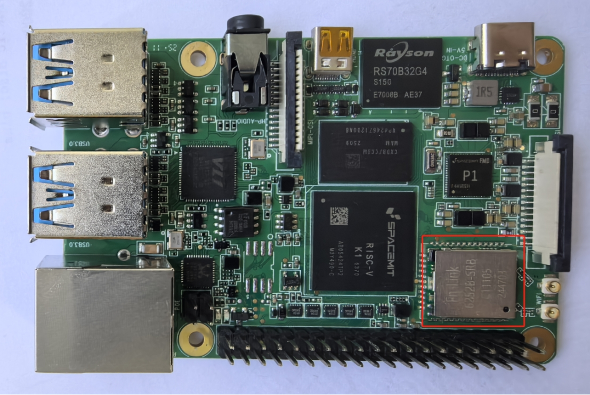 

### **10. 40pin接口**

RV4B支持40pin双排插针，线序如下：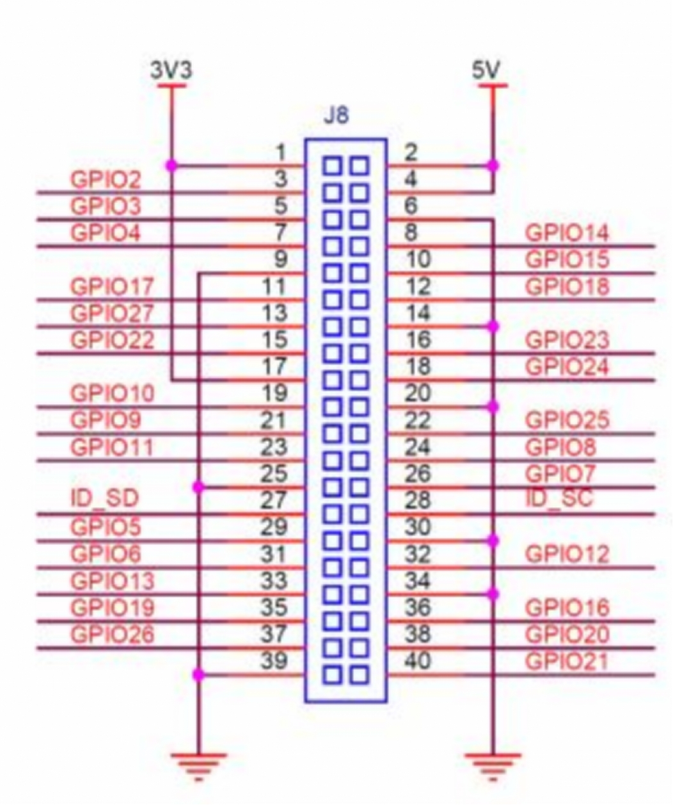

| **GPIO** | **Default** | **ALT0**   | **ALT1** | **ALT2**  | **ALT3**   | **ALT4**   | **ALT5**   |
| -------- | :---------- | ---------- | -------- | --------- | ---------- | ---------- | ---------- |
| 0        | High        | SDA0       | SA5      | PCLK      | SPI3 CE0 N | TXD2       | SDA6       |
| 1        | High        | SCL0       | SA4      | DE        | SPI3 MISO  | RXD2       | SCL6       |
| 2        | High        | SDA1       | SA3      | LCD VSYNC | SPI3 MOSI  | CTS2       | SDA3       |
| 3        | High        | SCL1       | SA2      | LCD HSYNC | SPI3 SCLK  | RTS2       | SCL3       |
| 4        | High        | GPCLK0     | SA1      | DPI D0    | SPI4 CE0 N | TXD3       | SDA3       |
| 5        | High        | GPCLK1     | SA0      | DPI D1    | SPI4 MISO  | RXD3       | SCL3       |
| 6        | High        | GPCLK2     | SOE N    | DPI D2    | SPI4 MOSI  | CTS3       | SDA4       |
| 7        | High        | SPI0 CE1 N | SWE N    | DPI D3    | SPI4 SCLK  | RTS3       | SCL4       |
| 8        | High        | SPI0 CE0 N | SD0      | DPI D4    | -          | TXD4       | SDA4       |
| 9        | Low         | SPI0 MISO  | SD1      | DPI D5    | -          | RXD4       | SCL4       |
| 10       | Low         | SPI0 MOSI  | SD2      | DPI D6    | -          | CTS4       | SDA5       |
| 11       | Low         | SPI0 SCLK  | SD3      | DPI D7    | -          | RTS4       | SCL5       |
| 12       | Low         | PWM0       | SD4      | DPI D8    | SPI5 CE0 N | TXD5       | SDA5       |
| 13       | Low         | PWM1       | SD5      | DPI D9    | SPI5 MISO  | RXD5       | SCL5       |
| 14       | Low         | TXD0       | SD6      | DPI D10   | SPI5 MOSI  | CTS5       | TXD1       |
| 15       | Low         | RXD0       | SD7      | DPI D11   | SPI5 SCLK  | RTS5       | RXD1       |
| 16       | Low         | FL0        | SD8      | DPI D12   | CTS0       | SPI1 CE2 N | CTS1       |
| 17       | Low         | FL1        | SD9      | DPI D13   | RTS0       | SPI1 CE1 N | RTS1       |
| 18       | Low         | PCM CLK    | SD10     | DPI D14   | SPI6 CE0 N | SPI1 CE0 N | PWM0       |
| 19       | Low         | PCM FS     | SD11     | DPI D15   | SPI6 MISO  | SPI1 MISO  | PWM1       |
| 20       | Low         | PCM DIN    | SD12     | DPI D16   | SPI6 MOSI  | SPI1 MOSI  | GPCLK0     |
| 21       | Low         | PCM DOUT   | SD13     | DPI D17   | SPI6 SCLK  | SPI1 SCLK  | GPCLK1     |
| 22       | Low         | SD0 CLK    | SD14     | DPI D18   | SD1 CLK    | ARM TRST   | SDA6       |
| 23       | Low         | SD0 CMD    | SD15     | DPI D19   | SD1 CMD    | ARM RTCK   | SCL6       |
| 24       | Low         | SD0 DAT0   | SD16     | DPI D20   | SD1 DAT0   | ARM TDO    | SPI3 CE1 N |
| 25       | Low         | SD0 DAT1   | SD17     | DPI D21   | SD1 DAT1   | ARM TCK    | SPI4 CE1 N |
| 26       | Low         | SD0 DAT2   | TE0      | DPI D22   | SD1 DAT2   | ARM TDI    | SPI5 CE1 N |
| 27       | Low         | SD0 DAT3   | TE1      | DPI D23   | SD1 DAT3   | ARM TMS    | SPI6 CE1 N |

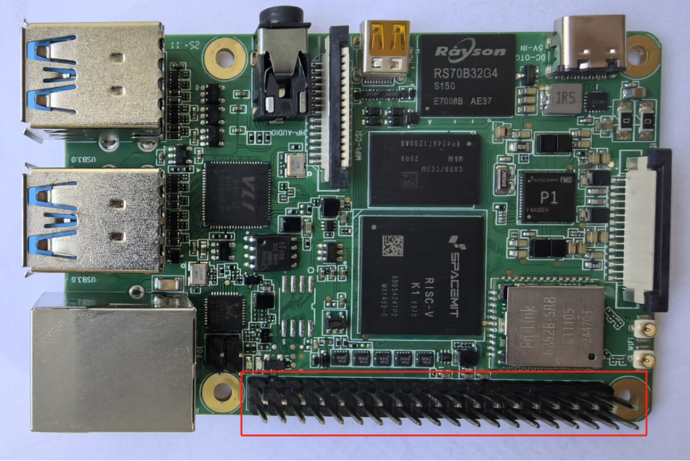 

### **11. JTAG调试接口**

RV4B在40pin 接口中预留Primary JTAG调试通道，线序如下

| 40pin | 网络名称    | JTAG信号名称 |
| ----- | ----------- | ------------ |
| 7     | GPI0_70_3V3 | PRI_TDI      |
| 11    | GPIO_71_3V3 | PRI_TMS      |
| 13    | GPI0_72_3V3 | PRI_TCK      |
| 15    | GPI0_73_3V3 | PRI_TDO      |

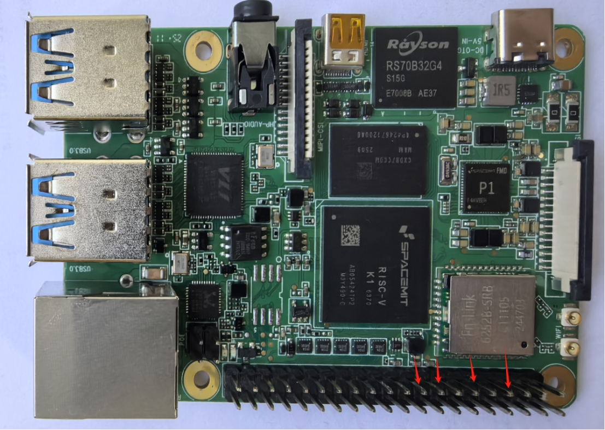 

### **12. UART调试接口**

RV4B设计3pin测试点焊盘，支持UART0（GPIO68-TX，GPIO69-RX）调试接口。

### **13. 音频接口**

RV4B支持1个3.5mm耳机座（耳机功能尚未开放，敬请期待）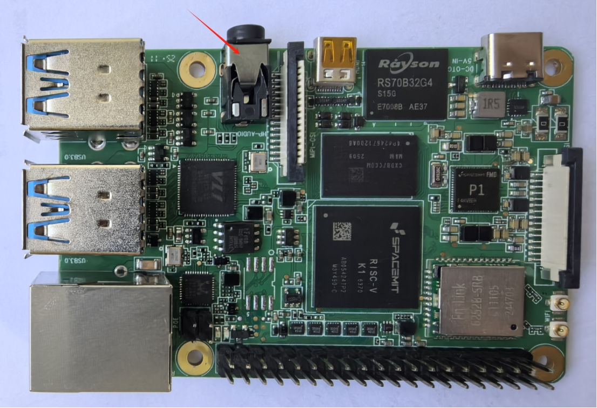

###  **14. TF卡接口（无弹片）**

开发板支持TF卡，方便开发者接入TF卡设备。同时支持debug扩展卡，用于UART0或JTAG调试

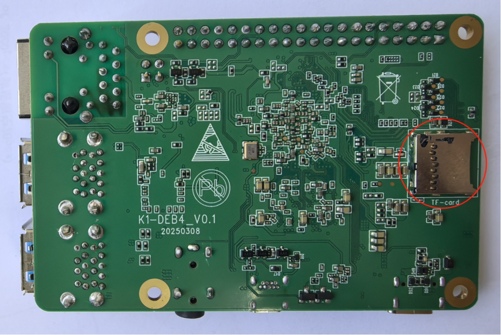 

## **注意事项**

K1 RV4B适用于实验室或者工程环境，开始操作前，请先阅读以下注意事项：

1. 任何情况下不可对屏幕接口、CSI接口及扩展板进行热插拔操作。
2. 拆封开发板包装和安装前，为避免静电释放（ESD）对开发板硬件造成损伤，请采取必要防静电措施。
3. 持开发板时请拿开发板边沿，不要触碰到开发板上的外露金属部分，以免静电对开发板元器件造成损坏。
4. 请将开发板放置于干燥的平面上，以保证它们远离热源、电磁干扰源与辐射源、电磁辐射敏感设备（如：医疗设备)等。