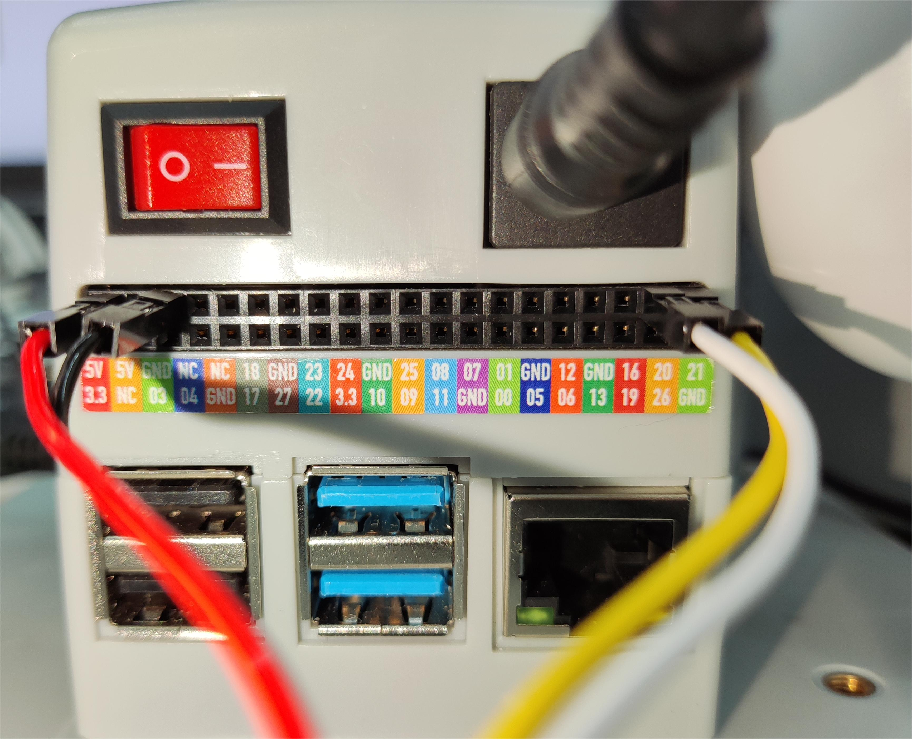

# 机器人吸泵搬运木块案例

## 1 功能说明
机器人会使用吸泵将木块从A点搬运到B点

## 2 硬件安装
将乐高连接件插入吸泵上预留的插孔中


将插好连接件的吸泵对准机械臂末端插孔插入


选出公-母杜邦线，母头端插入吸泵方盒上标有引脚的插口


然后将线接到机械臂的底座IO

> 左侧为吸泵引脚，右侧为机械臂引脚  
> GND -> GND  
> 5V -> 5V  
> G2 -> 21  
> G5 -> 20

## 3 吸泵测试
运行下面程序，吸泵会打开关闭的动作
```python
from pymycobot import MyCobot280,PI_PORT,PI_BAUD
import time
from gpiozero.pins.lgpio import LGPIOFactory
from gpiozero import Device
from gpiozero import LED

# 显式指定 GPIO 设备文件
Device.pin_factory = LGPIOFactory(chip=0)  # 使用 /dev/gpiochip0

# 初始化 GPIO 控制的设备
pump = LED(71)  # 使用 LED 类控制 GPIO 71（吸泵）
valve = LED(72)  # 使用 LED 类控制 GPIO 72（泄气阀门）

# 打开吸泵
pump.on()
print("吸泵已打开")

# 等待 3 秒
time.sleep(3)

# 关闭吸泵
pump.off()
print("吸泵已关闭")
time.sleep(0.05)

# 打开泄气阀门
valve.on()
print("泄气阀门已打开")
time.sleep(1)

# 关闭泄气阀门
valve.off()
print("泄气阀门已关闭")
time.sleep(0.05)

```

## 4 软件使用
利用myblockly的快速移动功能，对木块的抓取点和放置点进行示教，并且记录下位置信息,示教完后，需要断开串口的连接，否则会在运行python脚本时，报串口被占用的错误


## 5 复合应用
```python
from pymycobot import MyCobot280,PI_PORT,PI_BAUD
import time
from gpiozero.pins.lgpio import LGPIOFactory
from gpiozero import Device
from gpiozero import LED
init_angles=[-3.25, -2.46, -95.09, 9.22, 86.39, 93.33]#初始位置的6个关节角度
grab_point=[196.9, -197.1, 124.5, -178.8, 1.25, 173.32]#抓取点的坐标
place_point=[196.9, -97.1, 124.5, -178.8, 1.25, 173.32]#放置点的坐标

arm = MyCobot280(PI_PORT,PI_BAUD)
Device.pin_factory = LGPIOFactory(chip=0) # 显式指定/dev/gpiochip0
# 初始化 GPIOZERO 控制的设备
pump = LED(71)   # 气泵
valve = LED(72)  # 阀门
pump.on()
time.sleep(0.05)
valve.on()

# 开启吸泵
def pump_on():
    pump.on()
    valve.off()

# 停止吸泵
def pump_off():
    pump.off()
    valve.on()

if __name__=="__main__":
    pump_off()#先关闭吸泵 
    time.sleep(1)  
    arm.send_angles(init_angles,100)#运动初始位置
    time.sleep(2)
    arm.send_coords([grab_point[0],grab_point[1],grab_point[2]+70,grab_point[3],grab_point[4],grab_point[5]],100,1)#运动到抓取点上方70mm
    time.sleep(2)
    arm.send_coords([grab_point[0],grab_point[1],grab_point[2],grab_point[3],grab_point[4],grab_point[5]],100,1)#运动到抓取点
    time.sleep(2)
    pump_on() #打开吸泵
    time.sleep(1)
    arm.send_coords([grab_point[0],grab_point[1],grab_point[2]+70,grab_point[3],grab_point[4],grab_point[5]],100,1)#运动到抓取点上方70mm
    time.sleep(2)

    arm.send_coords([place_point[0],place_point[1],place_point[2]+70,place_point[3],place_point[4],place_point[5]],100,1)#运动到放置点上方70mm
    time.sleep(2)
    arm.send_coords([place_point[0],place_point[1],place_point[2],place_point[3],place_point[4],place_point[5]],100,1)#运动到放置点
    time.sleep(2)
    pump_off() #关闭吸泵
    time.sleep(1)
    arm.send_coords([place_point[0],place_point[1],place_point[2]+70,place_point[3],place_point[4],place_point[5]],100,1)#运动到放置点上方70mm
    time.sleep(2)
    
```
## 6 效果展示

