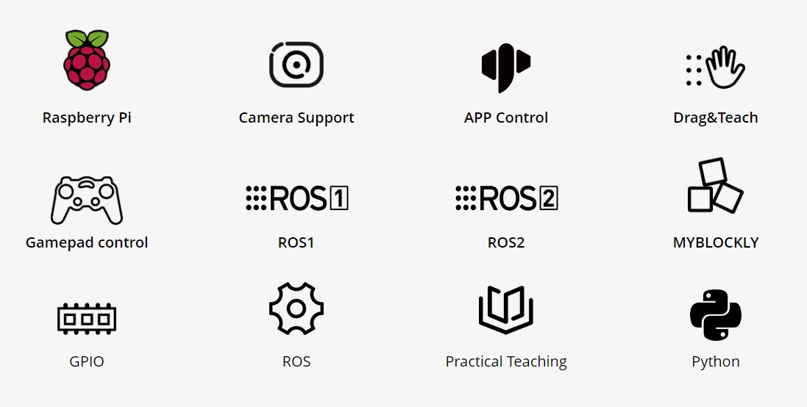
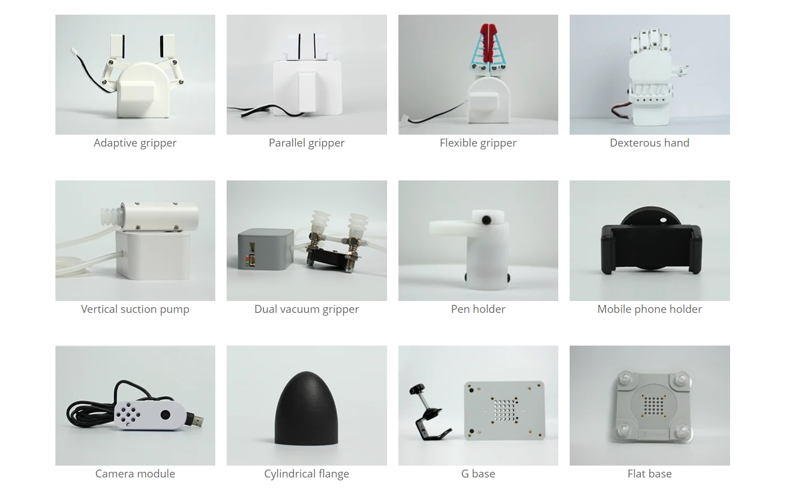

## Product Overview

##### myCobot 280 RISC-V

##### Desktop-level six-axis collaborative robot

### 1.Product Introduction

The myCobot 280 RISC-V six-axis collaborative robot is a lightweight RISC-V artificial intelligence robot arm created by Elephant Robotics and Indie Spacetime. It belongs to the "myCobot-series" product and is equipped with the **Indie Spacetime K1 RISC-V AI processor**. It is one of the core products of Elephant Robotics for **artificial intelligence robots** and **new generation RISC-V fusion AI education ecosystem**.

The myCobot 280 RISC-V six-axis collaborative robot weighs **860g**, has a payload of **250g**, and an arm span of **280mm**. It is small in size but powerful in function. It is equipped with the latest RISC-V AI processor K1. It provides general and easy-to-use AI computing power in the way of CPU fusion AI, deploys local AI models in the way of CPU, and can quickly access various mainstream large model algorithms. The platform is open source from the instruction set, chip hardware and software, operating system, robot control, case application and other full-stack technologies, provides comprehensive data cases, supports secondary development of all platforms and all algorithms, and effectively accelerates the exploration and implementation of various large model algorithms in robot applications.

### Design concept

myCobot 280 RISC-V robot arm is a six-degree-of-freedom collaborative robot developed by Elephant Robotics + Spacemit for scenarios such as scientific research and education, maker applications, and commercial displays. The appearance and structure of the robot arm are compact and exquisite, with a one-piece fully wrapped body design without any leaking cables. It is equipped with the robot motion control algorithm independently developed by Elephant Robotics, supporting multiple control modes such as angle, coordinate, potential value, and radian value, which is convenient for users to understand the complex working principles of robots and the application principles of robots. It uses the Advance Time and Space K1 RISC-V AI processor and has a built-in Bianbu OS operating system. It does not need to be matched with a PC master control. It can be used by connecting a monitor, keyboard, and mouse. It is the preferred assistant for quickly building robot arm programming education, control logic development, robot application, and ROS simulation experiment classroom, helping users quickly start learning and applying six-axis robot arms.

### Design goals

| Design goals | Description | Application scenarios and features |
| ---------------------- | ------------------------------------------------------------ | ------------------------------------------------------------ |
| **General multi-functional platform** | myCobot 280 RISC-V is suitable for a variety of application scenarios such as education, research and commercial display, maker development, etc. | Its six degrees of freedom and 280mm arm span support complex motion control in various working environments. It can be equipped with a variety of end accessories such as grippers and suction pumps to meet various scene applications. |
| **Education support** | myCobot 280 RISC-V supports drag-and-drop programming language, interactive drag teaching with buttons, and intuitive display of the working mode of the robotic arm. | The product supports the myblocky graphical programming tool. Programming by dragging and combining different modules helps beginners to intuitively experience the application of robots. |
| **Programmability and scalability** | The high programmability of myCobot 280 RISC-V allows users to customize and program according to emerging technologies to adapt to the needs of future technologies. | Through user-defined programming, the device can achieve optimized operation and experimental results to meet the ever-changing research and development. |
| **Technology innovation and knowledge dissemination** | myCobot 280 RISC-V can be used as a platform to showcase the latest scientific and technological achievements in commercial exhibitions, aiming to enhance the public's understanding and interest in science and technology, and promote the transformation of scientific and technological innovation into commercialization. | By displaying and demonstrating the latest scientific and technological achievements, increase public participation, promote the popularization of scientific and technological knowledge and the market acceptance of scientific and technological products. |

### Product Features

| | |
| ------------------------------------------------- | ------------------------------------------------------------ |
| **New AI computing platform, supports fast local deployment of large models** | Innovative fusion architecture, provides AI computing power in the form of CPU fusion AI, and quickly deploys various models.   Provides various open source algorithm cases such as CNN and Transfarmer to explore more possible AI scenarios. |
| **Open source RISC-V instruction set, global ecological co-construction** | K1-6370, RISC-V AI processor, 8-core X60 1.6GHz, provides 2.0TOPS fusion AI computing power.   Supports Bianbu OS, Open Harmory, Ubuntu and other operating systems. |
| **Built-in ROS, graphical programming Blockly** | Built-in ROS simulation of the robot arm's operating status, super scalability.  Blockly visual programming, while supporting general Python software interface. |
| **Image recognition, rich accessories, wide application** | Built-in image recognition algorithm, optional with any camera. Self-matching display, gripper suction pump and other accessories to achieve more application scenarios.   Supports the expansion of artificial intelligence kits for robot education and teaching. |
| **Unique industrial design, extremely compact** | Integrated design, compact overall body structure, net weight of only 860g, very easy to carry.   Modular design, few spare parts, low maintenance cost, can be quickly disassembled and replaced, and plug-and-play. |
| **High-configuration joint module, support LEGO interface** | Contains 6 high-performance servo motors, fast response, small inertia, and smooth rotation.   The base and the end are equipped with LEGO technology parts interfaces, suitable for the development of various micro embedded devices. |

## 2.Product Application

### User Group

| | |
| ---------------------------- | ------------------------------------------------------------ |
| **Educational Institutions** | myCobot 280 RISC-V can be used as a teaching and research tool designed for robot experiments and technical demonstrations. It does not need to be paired with a PC master control, and can be used by connecting a monitor, keyboard, and mouse. It provides image drag-and-drop programming software specifically for entry-level teaching, making it easy to understand the principles of the robotic arm. |
| **Technical Developers and Engineers** | Built-in Ubuntu Mate 20.04 operating system. Supports Raspberry Pi native hardware interfaces, dozens of official actuators, and the terminal Lego interface can be connected to various sensors to achieve color recognition and tracking, QR code and gesture recognition, voice broadcast and other functions. |
| **Commercial Display and Public Exhibition Organizers** | myCobot 280 RISC-V has become the preferred device for technology display and product demonstration with its precision operation display advantages. Dynamic demonstrations not only attract audiences, but also enhance their sense of participation, effectively promoting technological innovation and products. |
| **Geek development enthusiasts** | myCobot 280 RISC-V is based on the K1 RISC-V AI processor and supports the ROS open source system. Adaptive grippers, camera flanges, suction pumps and dozens of other accessories help you give full play to myCobot's creative ideas and meet the various creative ideas of enthusiasts. |

### 3.Application scenarios
| Applicable groups | **Application scenarios** | **Advantage targets** |
| -------------------------- | ------------------------------------------------------------ | ------------------------------------------------------------ |
| **Teachers and students in the field of education** | - STEM education - Robotics projects - Interdisciplinary research projects - Education and research | - Improve students' interest in science and technology - Enhance hands-on skills and problem-solving skills - Promote innovative thinking and teamwork - Provide a practical platform for data collection and robotics |
| **Makers and technical developers** | - Prototype development - Experimental research - Robot trial teaching | - Rich accessories - Connect theory and practice - Promote technological innovation |
| **Business presentations and marketing professionals** | - Exhibitions - Technology demonstrations - Brand promotion | - Attract potential customers and investors - Show the company's technical strength and innovative products - Enhance brand influence |

---

## Supported extended development

The mycobot series of robotic arms are extremely valuable in the fields of education and scientific research, especially in Python and ROS (Robot Operating System), two widely used development environments. These environments provide strong support, allowing the mycobot series of products to be widely used in machine learning, artificial intelligence research, complex motion control, and visual processing tasks. At the same time, with dozens of accessories such as adaptive grippers, camera flanges, suction pumps, etc., you can give full play to myCobot's creative ideas.

| | |
| ------------------------------------------------------------ | ------------------------------------------------------------ |
| **Python** | The robot supports Python and has a complete Python API library. The robot's joint angles, coordinates, grippers, etc. can be controlled through Python. |
| **ROS** | Supports ROS2 versions, and provides RVIZ simulation environment support.   Allows users to display the robot arm in real time and collect robot arm status information, making mycobot 280 RISC-V suitable for ROS beginners and educational purposes. |
| **Hardware interface** | Including IO, USB, etc., convenient for connecting various sensors and actuators. |
| **Software library** | Provides a wealth of open source libraries andAPI to simplify the development process. |
| **myBlockly** | It is both a graphical programming software and a visualization tool. Users can drag and drop modules to create programs. This process is very similar to building blocks, which is convenient, fast and easy to use. |

---

## 4.Where to buy

If you are interested in purchasing the device, please click on the link below:
Taobao: [https://shop504055678.taobao.com](https://shop504055678.taobao.com) 
Shopify: [https://shop.elephantrobotics.com/](https://shop.elephantrobotics.com/) 
AliExpress: [https://elephantrobotics.aliexpress.com/store/1101941423] (https://elephantrobotics.aliexpress.com/store/1101941423)

---

[Next Chapter →](../2.ProductParameter/2-ProductParameters.md)