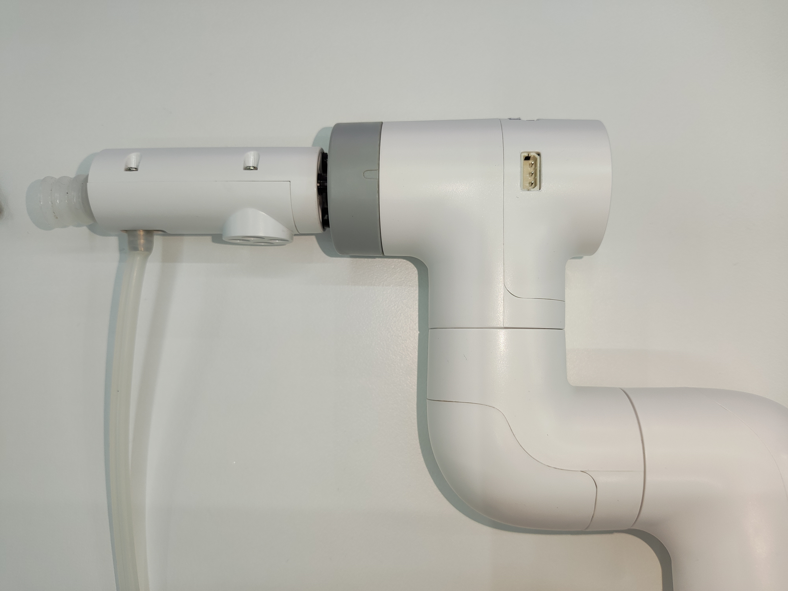
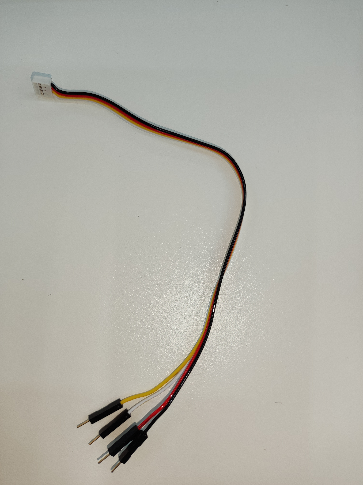
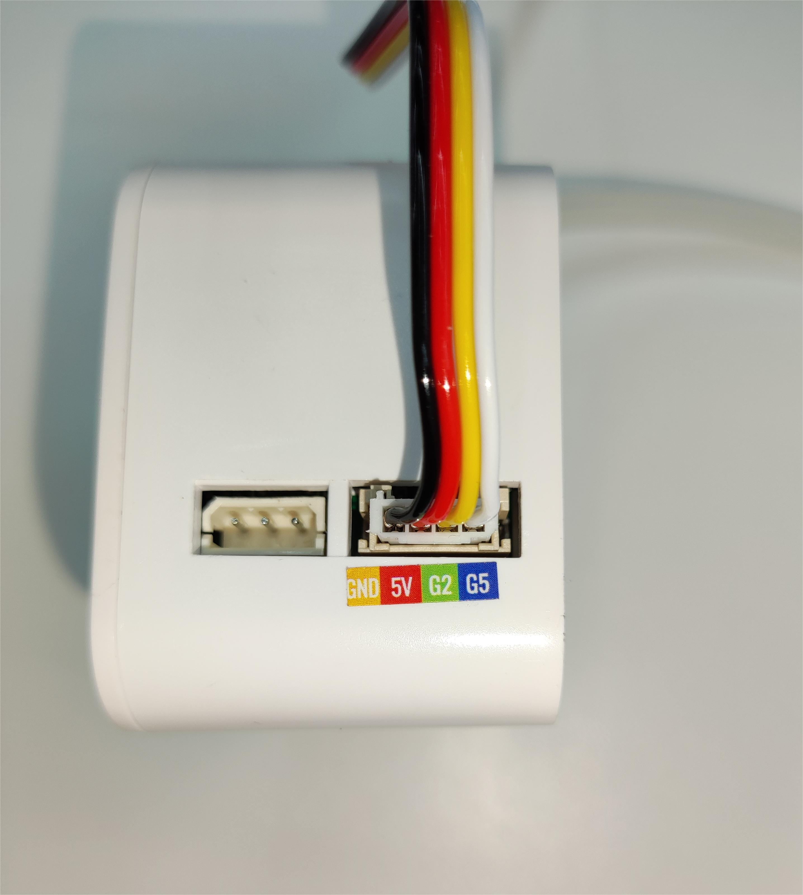
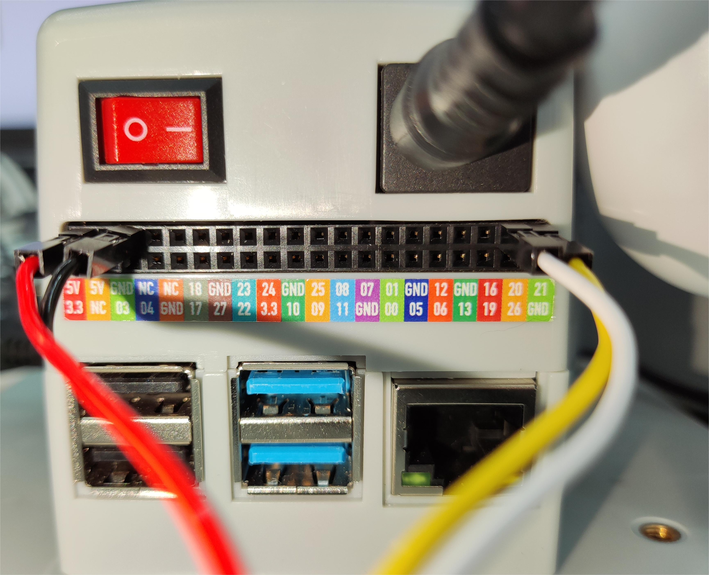

# Robot suction pump to carry wooden blocks

## 1 Functional description
The robot will use the suction pump to carry wooden blocks from point A to point B

## 2 Hardware installation
Insert the Lego connector into the reserved socket on the suction pump


Align the suction pump with the connector inserted into the socket at the end of the robot arm



Select the male-female DuPont wire, and insert the female end into the socket marked with pins on the suction pump box





Then connect the wire to the base IO of the robot arm


> The left side is the suction pump pin, and the right side is the robot arm pin
> GND -> GND
> 5V -> 5V
> G2 -> 21
> G5 -> 20

## 3 Pump test

Run the following program, the suction pump will open and close.

```python
from pymycobot import MyCobot280,PI_PORT,PI_BAUD
import time
from gpiozero.pins.lgpio import LGPIOFactory
from gpiozero import Device
from gpiozero import LED

# Explicitly specify GPIO device file
Device.pin_factory = LGPIOFactory(chip=0) # Use /dev/gpiochip0

# Initialize GPIO controlled device
pump = LED(71) # Use LED class to control GPIO 71 (suction pump)
valve = LED(72) # Use LED class to control GPIO 72 (deflation valve)

# Turn on the suction pump
pump.on()
print("Suction pump is turned on")

# Wait for 3 seconds
time.sleep(3)

# Turn off the suction pump
pump.off()
print("Suction pump is turned off")
time.sleep(0.05)

# Open the vent valve
valve.on()
print("Vent valve is open")
time.sleep(1)

# Close the vent valve
valve.off()
print("Vent valve is closed")
time.sleep(0.05)
```

## 4 Software Usage
Use the fast movement function of myblockly to teach the grabbing point and placement point of the wooden block, and record the position information. After teaching, you need to disconnect the serial port connection, otherwise the serial port will be reported when running the python script. The error is that the serial port is occupied.


## 5 Composite application
```python
from pymycobot import MyCobot280,PI_PORT,PI_BAUD
import time
from gpiozero.pins.lgpio import LGPIOFactory
from gpiozero import Device
from gpiozero import LED
init_angles=[-3.25, -2.46, -95.09, 9.22, 86.39, 93.33]#6 joint angles at the initial position
grab_point=[196.9, -197.1, 124.5, -178.8, 1.25, 173.32]#Coordinates of the grab point
place_point=[196.9, -97.1, 124.5, -178.8, 1.25, 173.32]#Coordinates of the placement point

arm = MyCobot280(PI_PORT,PI_BAUD)
Device.pin_factory = LGPIOFactory(chip=0) # Explicitly specify /dev/gpiochip0
# Initialize the device controlled by GPIOZERO
pump = LED(71) # Pump
valve = LED(72) # Valve
pump.on()
time.sleep(0.05)
valve.on()

# Turn on the suction pump
def pump_on():
    pump.on()
    valve.off()

# Stop the suction pump
def pump_off():
    pump.off()
    valve.on()

if __name__=="__main__":
    pump_off()#Turn off the pump first
    time.sleep(1)
    arm.send_angles(init_angles,100)#Move to the initial position
    time.sleep(2)
    arm.send_coords([grab_point[0],grab_point[1],grab_point[2]+70,grab_point[3],grab_point[4],grab_point[5]],100,1)#Move to 70mm above the grab point
    time.sleep(2)
    arm.send_coords([grab_point[0],grab_point[1],grab_point[2],grab_point[3],grab_point[4],grab_point[5]],100,1)#Move to the grab point
    time.sleep(2)
    pump_on() #Turn on the suction pump
    time.sleep(1)
    arm.send_coords([grab_point[0],grab_point[1],grab_point[2]+70,grab_point[3],grab_point[4],grab_point[5]],100,1)#Move to 70mm above the grab point
    time.sleep(2)
    
    arm.send_coords([place_point[0],place_point[1],place_point[2]+70,place_point[3],place_point[4],place_point[5]],100,1)#Move to 70mm above the placement point
    time.sleep(2)
    arm.send_coords([place_point[0],place_point[1],place_point[2],place_point[3],place_point[4],place_point[5]],100,1)#Move to the placement point
    time.sleep(2)
    pump_off() #Turn off the suction pump
    time.sleep(1)
    arm.send_coords([place_point[0],place_point[1],place_point[2]+70,place_point[3],place_point[4],place_point[5]],100,1)#Move to 70mm above the placement point
    time.sleep(2)

```
## 6 Effect display

