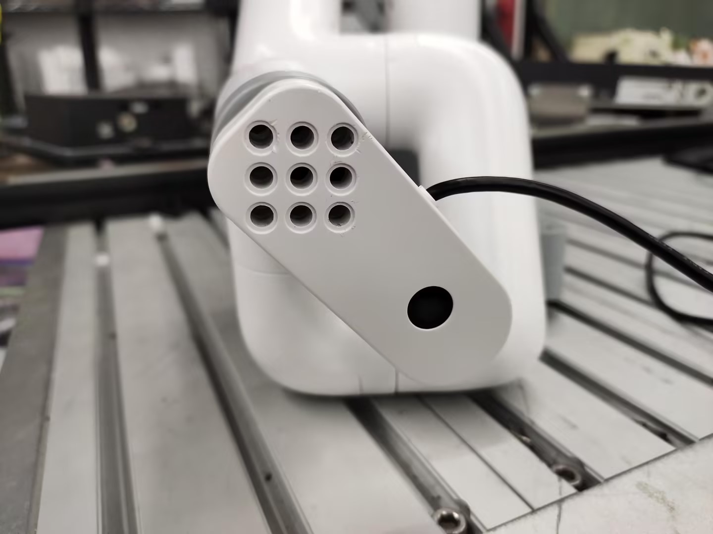
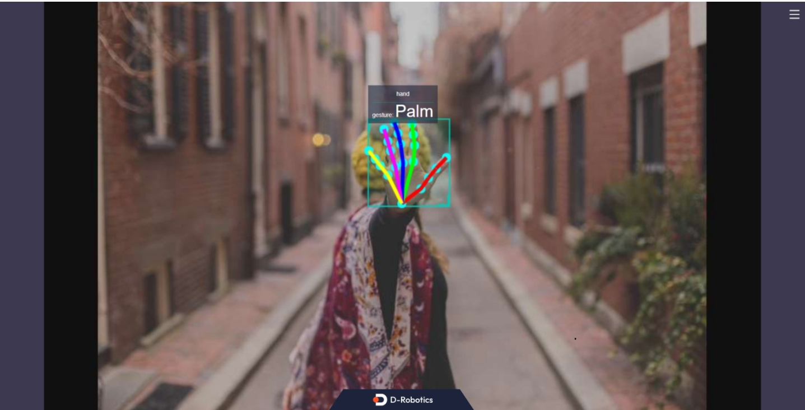
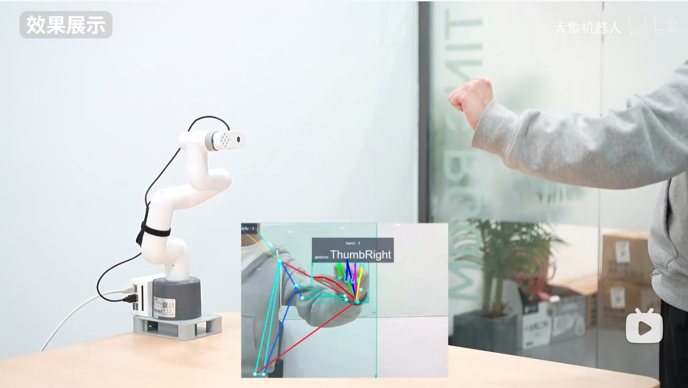

# 手势识别案例

## 1 硬件安装
先将末端法兰手动对齐刻度线


然后将相机按照图片的姿态安装到末端法兰上，再将相机线查到底部的主控的USB接口上




## 2 软件运行
打开一个终端输入命令，按下键盘回车键运行
```bash
export CAM_TYPE=usb
```
然后再输入下面命令，启动相机识别节点
```bash
ros2 launch hand_gesture_detection hand_gesture_detection.launch.py
```

输出log显示，节点运行成功
```shell
[hand_gesture_detection-5] [C][32711][08-12][09:39:39:575][configuration.cpp:49][EasyDNN]EasyDNN version: 0.4.11
[hand_gesture_detection-5] [DNN] Runtime version = 1.9.7_(3.14.5 HBRT)
[hand_gesture_detection-5] [WARN] [1660268379.611419981] [hand gesture det node]: input_idx: 0, tensorType = 8, tensorLayout = 0
[hand_gesture_detection-5] [WARN] [1660268379.619313022] [hand gesture det node]: Create subscription with topic_name: /hobot_hand_lmk_detection
[hand_gesture_detection-5] [WARN] [1660268379.629207314] [hand gesture det node]: ai_msg_pub_topic_name: /hobot_hand_gesture_detection
[mono2d_body_detection-3] (MOTMethod.cpp:39): MOTMethod::Init config/iou2_euclid_method_param.json
[mono2d_body_detection-3] 
[mono2d_body_detection-3] (IOU2.cpp:34): IOU2 Mot::Init config/iou2_euclid_method_param.json
[mono2d_body_detection-3] 
[mono2d_body_detection-3] (MOTMethod.cpp:39): MOTMethod::Init config/iou2_method_param.json
[mono2d_body_detection-3] 
[mono2d_body_detection-3] (IOU2.cpp:34): IOU2 Mot::Init config/iou2_method_param.json
[mono2d_body_detection-3] 
[mono2d_body_detection-3] (MOTMethod.cpp:39): MOTMethod::Init config/iou2_method_param.json
[mono2d_body_detection-3] 
[mono2d_body_detection-3] (IOU2.cpp:34): IOU2 Mot::Init config/iou2_method_param.json
[mono2d_body_detection-3] 
[mono2d_body_detection-3] (MOTMethod.cpp:39): MOTMethod::Init config/iou2_method_param.json
[mono2d_body_detection-3] 
[mono2d_body_detection-3] (IOU2.cpp:34): IOU2 Mot::Init config/iou2_method_param.json
[mono2d_body_detection-3] 
[hand_gesture_detection-5] [WARN] [1660268381.026173815] [hand_gesture_det]: Sub smart fps 31.16
[hand_gesture_detection-5] [WARN] [1660268381.206196565] [hand_gesture_det]: Pub smart fps 30.17
[hand_gesture_detection-5] [WARN] [1660268382.054034899] [hand_gesture_det]: Sub smart fps 30.19
[hand_gesture_detection-5] [WARN] [1660268382.234087357] [hand_gesture_det]: Pub smart fps 30.19
[hand_gesture_detection-5] [WARN] [1660268383.055988982] [hand_gesture_det]: Sub smart fps 29.97
[hand_gesture_detection-5] [WARN] [1660268383.235230316] [hand_gesture_det]: Pub smart fps 30.00
[hand_gesture_detection-5] [WARN] [1660268384.087152150] [hand_gesture_det]: Sub smart fps 30.10
[hand_gesture_detection-5] [WARN] [1660268384.256141566] [hand_gesture_det]: Pub smart fps 30.39
```


在PC端的浏览器输入http://IP:8000 即可查看图像和算法渲染效果（IP为RDK的IP地址）：



| 手势       | 说明       | 数值 |
| ---------- | ---------- | ---- |
| ThumbUp    | 竖起大拇指 | 2    |
| Victory    | “V”手势    | 3    |
| Mute       | “嘘”手势   | 4    |
| Palm       | 手掌       | 5    |
| Okay       | OK手势     | 11   |
| ThumbLeft  | 大拇指向左 | 12   |
| ThumbRight | 大拇指向右 | 13   |
| Awesome    | 666手势    | 14   |

### 案例程序
```python
import rclpy
from rclpy.node import Node
from ai_msgs.msg import PerceptionTargets
from sensor_msgs.msg import CompressedImage
from pymycobot import MyCobot280RDKX5,utils
import time
import cv2
import numpy as np
class MinimalSubscriber(Node):
    def __init__(self):
        self.mc=MyCobot280RDKX5("/dev/ttyS1",1000000)
        self.mc.set_fresh_mode(0)
        self.mc.sync_send_angles([0,0,0,0,0,46.3],100)
        print("ok")
        super().__init__('minimal_subscriber')

        self.cam_subscription = self.create_subscription(
            CompressedImage,
            '/image',  
            self.cam_listener_callback,
            10)

        self.subscription = self.create_subscription(
            PerceptionTargets,
            'hobot_hand_gesture_detection',
            self.listener_callback,
            10)
        self.subscription  # prevent unused variable warning
        
        
        self.value=None
        self.img=None
        self.count=0
        # self.lock = threading.Lock()

    def cam_listener_callback(self, msg):
       
        np_arr = np.frombuffer(msg.data, np.uint8)
        cv_image = cv2.imdecode(np_arr, cv2.IMREAD_COLOR)
        self.img=cv_image
     
    def listener_callback(self, msg):
        
        for target in msg.targets:
            for attribute in target.attributes:
                self.get_logger().info(f'Value: "{attribute.value}"')
                # self.get_logger().info(f'confidence: "{attribute.confidence}"')
                tmp=int(attribute.value)
                self.count+=1
                #print (f"count={self.count}")
                if self.count==50 and tmp==self.value:
                    if self.value==5:
                        self.mc.send_angles([0,0,0,0,0,46.3],100)
                        time.sleep(1)
                        self.mc.send_angles([0, -15.99, -49.57, 67.93, 7.99, 46.3],100)
                        time.sleep(1)
                        # self.mc.sync_send_angles([0, 30.58, -49.57, 12.48, 21.44, 0],100)
                        # time.sleep(1)
                        self.mc.send_angles([0,0,0,0,0,46.3],100)
                        time.sleep(1)
                        # self.value=None
                    elif self.value==3:
                        if self.img is not None:
                            cv2.imshow("Compressed Image", self.img)
                            cv2.waitKey(2000)
                            cv2.destroyAllWindows()
                            # self.value=None

                    elif self.value==11:
                        for i in range(1):
                            self.mc.send_angles([0, 0, 0, -70, 0, 46.3],100)
                            time.sleep(1)
                            self.mc.send_angles([0, 0, 0, 0, 0, 46.3],100)
                            time.sleep(1)
                            # self.value=None
                    elif self.value==12:
                        self.mc.send_angles([0, -15.99, -49.57, 67.93, 7.99, 46.3],100)
                        time.sleep(1)
                        self.mc.send_angles([-30.58, -45.61, -0.96, 47.37, 38.84, 46.3],100)
                        time.sleep(1)
                    elif self.value==13:
                        self.mc.send_angles([0, -15.99, -49.57, 67.93, 7.99, 46.3],100)
                        time.sleep(1)
                        self.mc.send_angles([34.36, -6.24, -63.1, 69.96, -26.27, 46.3],100)
                        time.sleep(1)

                    elif self.value==2:
                        self.mc.send_angles([0, -15.99, -49.57, 67.93, 7.99, 46.3],100)
                        time.sleep(1)
                        self.mc.send_angles([0.79, -13.35, -28.38, 37.7, 7.47, 46.3],100)
                        time.sleep(1)

                    elif self.value==4:
                        self.mc.send_angles([0.7, 48.33, -113.55, 61.43, 0.0, 46.3],100)
                        time.sleep(1)

                    elif self.value==14:
                        self.mc.send_angles([0.7, 48.33, -113.55, 61.43, 0.0, 46.3],100)
                        time.sleep(1)
                        for i in range(3):
                            self.mc.send_angles([0.7, 48.33, -113.55, 61.43, 0.0, 46.3],100)
                            self.mc.send_angles([0.7, 33.92, -77.34, 38.4, 0.08, 46.3],100)
                        self.mc.send_angles([0.7, 33.92, -77.34, 38.4, 0.08, 46.3],100)
                        time.sleep(2)
                       
                    self.count=0


                self.value=tmp
                if self.count>50:
                    self.count=0

def main(args=None):
    rclpy.init(args=args)
    minimal_subscriber = MinimalSubscriber(
    rclpy.spin(minimal_subscriber)
    minimal_subscriber.destroy_node()
    rclpy.shutdown()

if __name__ == '__main__':
    main()
```

## 效果展示

[视频链接](https://www.bilibili.com/video/BV1oLfBYpEwR/?spm_id_from=333.1387.homepage.video_card.click&vd_source=672e3f7240eaaca210b45e7c033dc45f)

