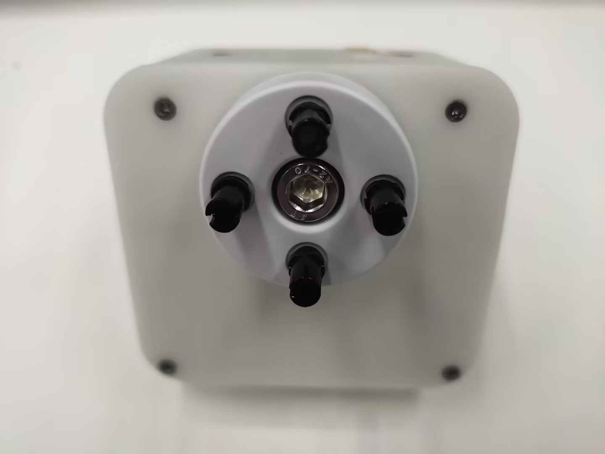

# 机器人吸泵搬运木块案例

## 1 功能说明
机器人会使用吸泵将木块从A点搬运到B点

## 2 硬件安装
将乐高连接件插入吸泵上预留的插孔中


将插好连接件的吸泵对准机械臂末端插孔插入


选出公-母杜邦线，母头端插入吸泵方盒上标有引脚的插口


然后将线接到机械臂的末端IO

> 左侧为吸泵引脚，右侧为机械臂引脚  
> GND -> GND  
> 5V -> 5V  
> G2 -> 23  
> G5 -> 33

## 3 吸泵测试
运行下面程序，吸泵会重复2次打开关闭的动作
```python
from pymycobot import MyCobot280,utils
import time

arm = MyCobot280(utils.get_port_list()[0])
time.sleep(2)
# 开启吸泵
def pump_on():
    arm.set_digital_output(33, 0)
    time.sleep(0.05)

# 停止吸泵
def pump_off():
    arm.set_digital_output(33, 1)
    time.sleep(0.05)
    arm.set_digital_output(23, 0)
    time.sleep(1)
    arm.set_digital_output(23, 1)
    time.sleep(0.05)

for i in range(2):
    pump_on()
    time.sleep(2)
    pump_off()
    time.sleep(2)
```

## 4 软件使用
利用myblockly的快速移动功能，对木块的抓取点和放置点进行示教，并且记录下位置信息,示教完后，需要断开串口的连接，否则会在运行python脚本时，报串口被占用的错误


## 5 复合应用
```python
from pymycobot import MyCobot280,utils
import time
init_angles=[33.22, -15.55, -100.54, 25.48, 6.76, -13.35]#初始位置的6个关节角度
grab_point=[189.9, 12.1, 54.5, -178.15, 6.89, -43.47]#抓取点的坐标
place_point=[189.9, 120.1, 62.5, -178.15, 6.89, -43.47]#放置点的坐标

arm = MyCobot280(utils.get_port_list()[0])
time.sleep(2)
# 开启吸泵
def pump_on():
    arm.set_digital_output(33, 0)
    time.sleep(0.05)

# 停止吸泵
def pump_off():
    arm.set_digital_output(33, 1)
    time.sleep(0.05)
    arm.set_digital_output(23, 0)
    time.sleep(1)
    arm.set_digital_output(23, 1)
    time.sleep(0.05)

if __name__=="__main__":
    pump_off()#先关闭吸泵 
    time.sleep(1)  
    arm.send_angles(init_angles,100)#运动初始位置
    time.sleep(2)
    arm.send_coords([grab_point[0],grab_point[1],grab_point[2]+70,grab_point[3],grab_point[4],grab_point[5]],100,1)#运动到抓取点上方70mm
    time.sleep(2)
    arm.send_coords([grab_point[0],grab_point[1],grab_point[2],grab_point[3],grab_point[4],grab_point[5]],100,1)#运动到抓取点
    time.sleep(2)
    pump_on() #打开吸泵
    time.sleep(1)
    arm.send_coords([grab_point[0],grab_point[1],grab_point[2]+70,grab_point[3],grab_point[4],grab_point[5]],100,1)#运动到抓取点上方70mm
    time.sleep(2)

    arm.send_coords([place_point[0],place_point[1],place_point[2]+70,place_point[3],place_point[4],place_point[5]],100,1)#运动到放置点上方70mm
    time.sleep(2)
    arm.send_coords([place_point[0],place_point[1],place_point[2],place_point[3],place_point[4],place_point[5]],100,1)#运动到放置点
    time.sleep(2)
    pump_off() #关闭吸泵
    time.sleep(1)
    arm.send_coords([place_point[0],place_point[1],place_point[2]+70,place_point[3],place_point[4],place_point[5]],100,1)#运动到放置点上方70mm
    time.sleep(2)
    
```
## 6 效果展示

