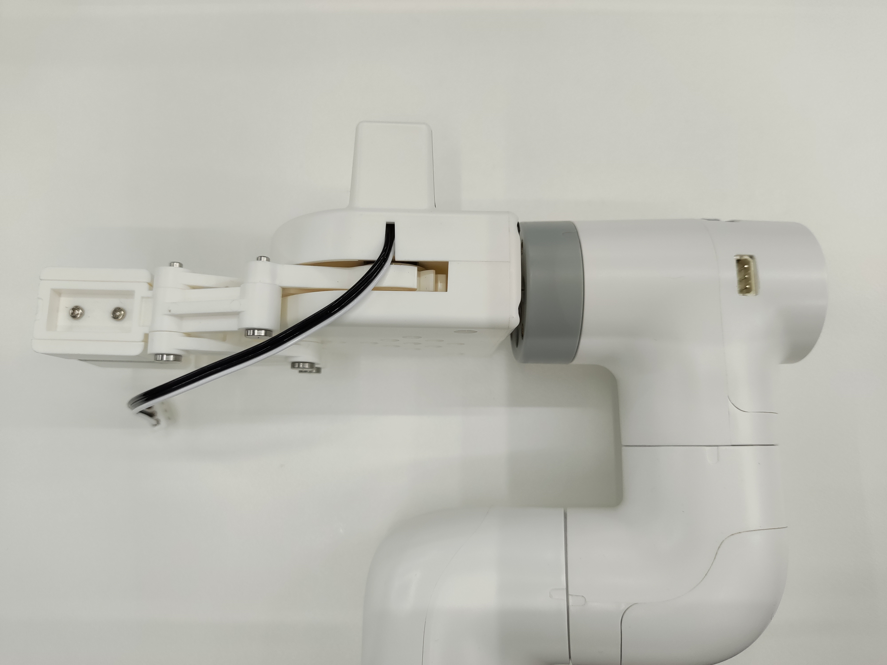
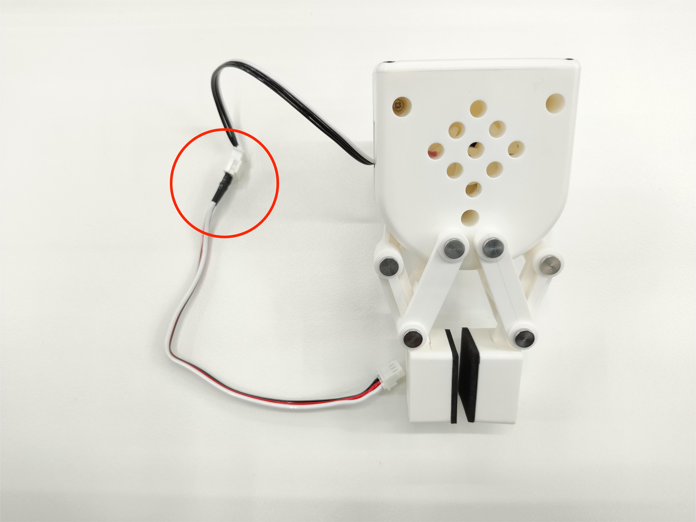
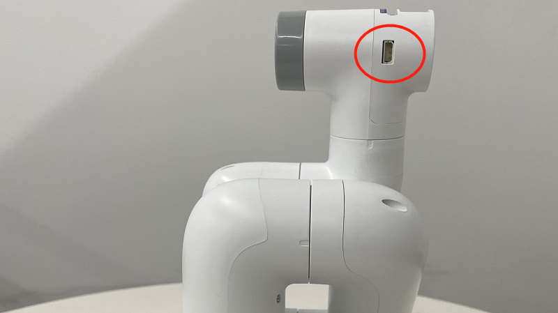

# Robot gripper carrying wooden block example

## 1 Functional description
The robot will use the gripper to carry the wooden block from point A to point B

## 2 Hardware installation
Insert the Lego connector into the reserved socket of the gripper


Align the gripper with the connector inserted into the socket at the end of the robot arm and insert it



Connect the extension cable to the gripper



Insert the robot arm control interface




## 3 Gripper test
Run the following program, the gripper will repeat the closing and opening action twice

```python
from pymycobot import MyCobot280,utils
import time

arm=MyCobot280(utils.get_port_list()[0])
for i in range(2):
    arm.set_gripper_state(1,100)
    time.sleep(1)
    arm.set_gripper_state(1,100)
    time.sleep(1)
```
## 4 Software Usage
Use the fast movement function of myblockly to teach the grabbing point and placement point of the wooden block, and record the position information. After teaching, you need to disconnect the serial port connection, otherwise the serial port will be reported when running the python script. The error is that the serial port is occupied.


## 5 Composite application
```python
from pymycobot import MyCobot280,utils
import time

init_angles=[-3.25, -2.46, -95.09, 9.22, 86.39, 93.33]#6 joint angles at the initial position
grab_point=[214.5, -189.9, 185.5, -177.5, 1.91, 173.49]#Coordinates of the gripping point
place_point=[214.5, -50.9, 185.5, -177.5, 1.91, 173.49]#Coordinates of the placement point

arm=MyCobot280(utils.get_port_list()[0])
if __name__=="__main__":
    arm.set_gripper_state(0,100)#Open the gripper first
    time.sleep(1)
    arm.send_angles(init_angles,100)#Initial position of movement
    time.sleep(2)
    arm.send_coords([grab_point[0],grab_point[1],grab_point[2]+70,grab_point[3],grab_point[4],grab_point[5]],100,1)#Move to 70mm above the grab point
    time.sleep(2)
    arm.send_coords([grab_point[0],grab_point[1],grab_point[2],grab_point[3],grab_point[4],grab_point[5]],100,1)#Move to the grab point
    time.sleep(2)
    arm.set_gripper_state(1,100)#Clamp the gripper
    time.sleep(1)
    arm.send_coords([grab_point[0],grab_point[1],grab_point[2]+70,grab_point[3],grab_point[4],grab_point[5]],100,1)#Move to 70mm above the grab point
    time.sleep(2)
    
    arm.send_coords([place_point[0],place_point[1],place_point[2]+70,place_point[3],place_point[4],place_point[5]],100,1)#Move to 70mm above the placement point
    time.sleep(2)
    arm.send_coords([place_point[0],place_point[1],place_point[2],place_point[3],place_point[4],place_point[5]],100,1)#Move to the placement point
    time.sleep(2)
    arm.set_gripper_state(0,100)#Open the gripper
    time.sleep(1)
    arm.send_coords([place_point[0],place_point[1],place_point[2]+70,place_point[3],place_point[4],place_point[5]],100,1)#Move to 70mm above the placement point
    time.sleep(2)
```
## 6 Effect display
